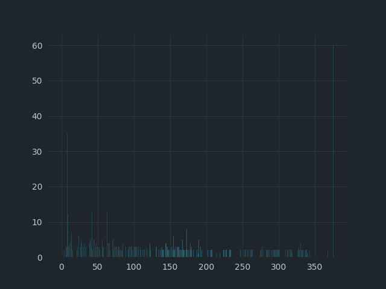
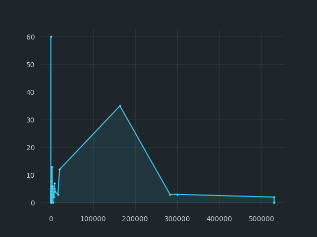
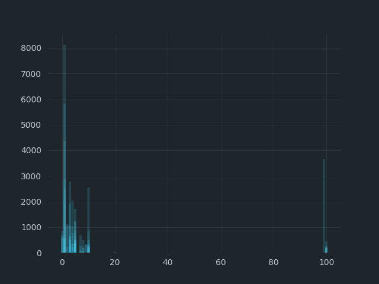

# Near Stake Wars: Episode III Challenge 7: Data Science for Staking 
###"Dependence of contributors on technical parameters"


* Publication date: 2022-08-03
* My Telegram: [vindemure](https://t.me/vindemure) 

## Introduction
Hello, I collected and did data analysis to see the ratio of the number of contributors to technical parameters in order to reveal interesting patterns.

## Lets code!
### Parse it
To collect data from explorers, I used a simple parsing using selenium and beautiful soup in Python:
> you can find the full code in the repository
```
    browser = webdriver.Firefox(
        executable_path=r'<your-path>',
    )
    pgs_links = {7: SHARDNET_LINK, 3: MAINNET_LINK}
    result_data = {'shardnet': [], 'mainnet': []}

    for pgs, link in pgs_links.items():
        pg = 1
        browser.get(link)

        for page in range(pgs):
            pg += 1
            logger.info(f'{page} - start')
            main_page = browser.page_source
            soup = bs4.BeautifulSoup(main_page, features="lxml")
            search_results = soup.find_all(
                class_='c-TableRowWrapper-jUPfkR mx-0'
            )

            for n, result in enumerate(search_results, start=1):
                if n > 3:
                    n += 1
                try:
                    position = result.find(
                        class_="c-OrderTableCell-clytRC"
                    ).text
                    status = result.find(
                        class_="c-ValidatingLabelWrapper-eennLm c-ValidatingLabelWrapper-eennLm-fFWhBO-type-active badge"
                    ).text
                    total = result.find(
                        class_="c-ValidatorNodesText-hdougQ c-StakeText-ePtfAL text-right"
                    ).text

                    fee = soup.select_one(
                        f'div.c-AppWrapper-eIdCBM > div.c-ContentContainer-fGHEql.c-NodesPage-dfbLrd.container-fluid > div.container-fluid > div.c-ValidatorsWrapper-emjxtC.container > div > div > table > tbody > tr:nth-child({n}) > td:nth-child(5)'
                    ).text
                    contr = soup.select_one(
                        f'div.c-AppWrapper-eIdCBM > div.c-ContentContainer-fGHEql.c-NodesPage-dfbLrd.container-fluid > div.container-fluid > div.c-ValidatorsWrapper-emjxtC.container > div > div > table > tbody > tr:nth-child({n}) > td:nth-child(6)'
                    ).text

                    logger.info(f'{page} - find: {position}, {status}, {fee}, {contr}, {total}')
                    validator_data = {
                        'position': position,
                        'status': status,
                        'fee': fee,
                        'contributors': contr,
                        'total': total
                    }
                except Exception as e:
                    logger.error(f'\n{traceback.format_exc()}\n\n')
                else:
                    logger.info(f'\ndata: {validator_data}\n\n')
                    if link == MAINNET_LINK:
                        k = 'mainnet'
                    else:
                        k = 'shardnet'
                    result_data.get(k).append(validator_data)

            if pg > pgs:
                break
            next_page = browser.find_element_by_css_selector(
                f'.c-PaginateWrapper-bBXXIO > li:nth-child({3 if pg == 2 else pg}) > a:nth-child(1)'
            )
            next_page.click()

        filename = 'active_validators.json'
        with open(filename, 'w', encoding='utf-8') as file:
            json.dump(result_data, file, indent=4, ensure_ascii=False)
            logger.info(f'{filename} - data well written')
        return filename
```
###Graphs Time

Now that I have the data of active validators in the shardnet and mainnet networks, I visualize the data using matplotlib.

```
def build_graph(graph_name: str, x, y):
    logger.info(f'Start build graph with: \n\n{x}\n{y}\n')

    picture = plt.figure(
        figsize=(6.4, 4.8),
        dpi=100,
        facecolor='#1e262c',
        edgecolor='#1e262c'
    )
    graph = picture.add_subplot(1, 1, 1)

    graph.grid(
        visible=True,
        which='major',
        axis='both',
        alpha=0.1,
        antialiased=True,
        dash_capstyle='butt'
    )

    graph.set_facecolor('#1e262c')

    graph.tick_params(
        axis='both',
        color='#1e262c',
        labelcolor='#c4c9cd'
    )
    graph.spines['bottom'].set_color('#1e262c')
    graph.spines['top'].set_color('#1e262c')
    graph.spines['right'].set_color('#1e262c')
    graph.spines['left'].set_color('#1e262c')

    graph.fill_between(
        x, y,
        color='#43c4e3',
        alpha=0.10
    )
    graph.plot(
        x, y,
        color='#43c4e3',
        solid_capstyle='round',
        linestyle='solid',
        marker='.',
        markerfacecolor='white',
        markersize=4,
        linewidth=1.5)

    pic_name = f'graphs/{graph_name}.png'
    picture.savefig(pic_name)
    logger.info(f'Graph successfully saved to {pic_name}')
    return pic_name


def build_bar(graph_name: str, width: int, x, y):
    logger.info(f'Start build graph with: \n\n{x}\n{y}\n')

    picture = plt.figure(
        figsize=(6.4, 4.8),
        dpi=100,
        facecolor='#1e262c',
        edgecolor='#1e262c'
    )
    graph = picture.add_subplot(1, 1, 1)

    graph.grid(
        visible=True,
        which='major',
        axis='both',
        alpha=0.1,
        antialiased=True,
        dash_capstyle='butt'
    )

    graph.set_facecolor('#1e262c')

    graph.tick_params(
        axis='both',
        color='#1e262c',
        labelcolor='#c4c9cd'
    )
    graph.spines['bottom'].set_color('#1e262c')
    graph.spines['top'].set_color('#1e262c')
    graph.spines['right'].set_color('#1e262c')
    graph.spines['left'].set_color('#1e262c')

    graph.bar(
        x, y,
        color='#43c4e3',
        alpha=0.10
    )
    bar_another = plt.bar(x, y, width=width, color='#43c4e3', alpha=0.10)

    pic_name = f'graphs/{graph_name}_bar.png'
    picture.savefig(pic_name)
    logger.info(f'Graph successfully saved to {pic_name}')
    return pic_name
```

##Data analysis
Now, with such interesting graphs, it's time to discuss the correlations of the number of contributors to various parameters that I analyzed.

### Trust the best
These ratios of the position in the list to the number of contributors in the mainnet of any pools (not only in niche and not only in cryptocurrency) have a trend similar to this graph.

**Mainnet:**


It is an obvious relationship that the first is always easier to trust. I want to draw your attention to the increasing interest of depositors in the 30th - 50th place. It is in these places that a feature is born that will be better seen in the next block, namely the formation of pools with a small share of self-steak and a huge number of small deposits - such pools hold on to the common efforts of a large number of small investors to resist the whales.

It’s hard to find a relationship in the Shardnet network - there are a small number of contributors from outside, since the validation threshold is not high and everyone tries to validate on their own. **In such places, a lazy, relaxed atmosphere** where the features of market competition are faintly visible.

**Shardnet:**




### Moby-Dick or, The Stake Whale
It's no secret that under pos-systems, the main problem is the problem of justice, because under them there is a situation that the rich will inevitably become even richer (we say hello to Karl Marx). 

However, the mainnet graphs show that in addition to this, to counter the situation described above, highly decentralized pools are created - in which a large number of contributors form a stake, due to their own small slices. 

I think just such pools are the most valuable for pos systems.

**Mainnet:**


> Just look at the concentration!


For the shardnet network, the main concentration is accumulated at the smallest through stakes, and a couple of whales appear (and what did you think, there are no whales in the test networks). 

Such networks look very decentralized and damp, everything up to the first mainnet :)

**Shardnet:**




### Greed is normal

Here we see data that is the same for both networks. This is the ratio of the contributor to the percentage of the commission - in most people they prefer low commissions, or medium to standard ones. 

This relationship shows that the best strategy is to keep the bet at an average level, winning in other categories (for example, for the average of your popularity), but if you need to attract people, you should set a lower percentage, but not a critically lower one, so as not to arouse suspicion. My words are reinforced by the bar graphs below. 

Columns at 100% may cause you more questions, this is just a self-stake technique to prevent random passers-by from investing and nothing paranormal

**Mainnet:**



**Shardnet:**


## Conclusion
Thank you for reading this analysis, I hope it was useful and visual for you.

Revisiting the charts makes us think about fundamental things in our value exchange system. For example, the pos-protocol is often criticized for its injustice, but aren't the same processes in all areas around us? 

I leave many questions open for you to think about. All the best see you later!


